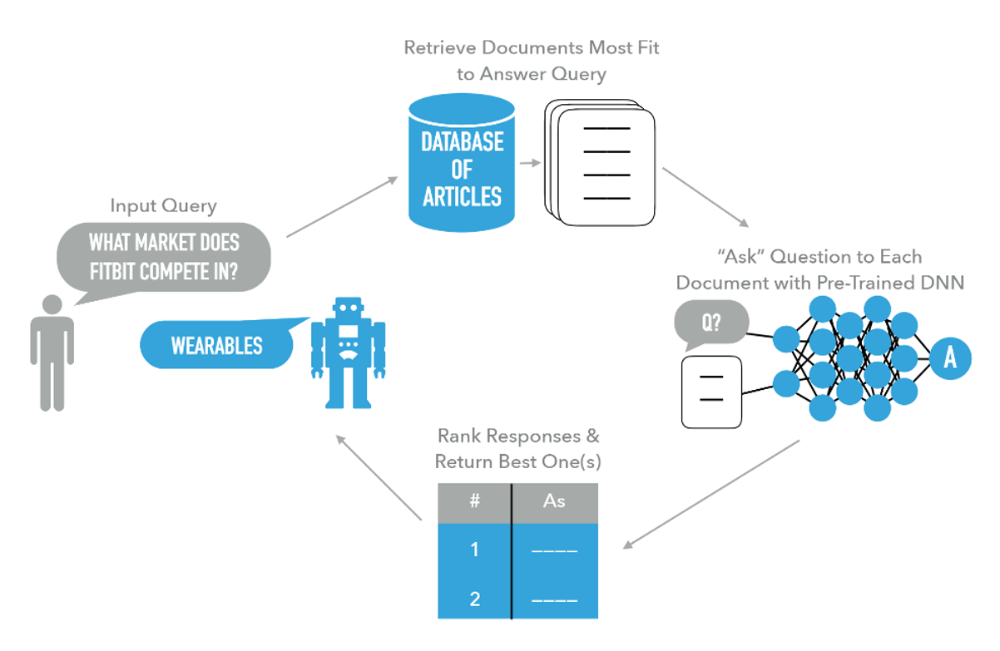

# QA Query

This repo holds all the content for the [ODSC](https://odsc.com/) West 2019 training session: 'Building a Natural Language Question & Answer Search Engine'.  See [accompanying blog post on the ODSC site](https://opendatascience.com/building-a-natural-language-question-answer-search-engine/) for more background info.

<p align='center'>
  
</p>

## Prerequisites

### General Prerequisite Skills/Knowledge

* Intermediate Python skills (i.e. [inheritance](https://www.w3schools.com/python/python_inheritance.asp) will be used in the session; however, it's not a big part of the session).
* Some general knowledge of typical NLP pre-processing tasks.

### Workspace set-up

All materials used in the session can be found in the GitHub repo: [github.com/AdamSpannbauer/qa_query](https://github.com/AdamSpannbauer/qa_query).  To install everything for the training session run the below commands.

*Note: All of the materials were developed with Python v3.6.5; a virtual environment is recommended.*

```bash
# Clone repo to be used
git clone https://github.com/AdamSpannbauer/qa_query.git

# Change to the repo's dir & install requirements
pip install -r requirements.txt

# Download pre-trained model to be used
python -m deeppavlov install squad_bert
```

## Repo Structure

The repo has 3 main branches to be used in the training session.

### [`master`](https://github.com/AdamSpannbauer/qa_query/tree/master) Branch

* Holds the [slides](https://github.com/AdamSpannbauer/qa_query/blob/master/slides.pdf) to be used in the training session
* Main branch paired with the talking points of the training session
* Holds a framework and data to build a Q&A query process with NASDAQ articles

### [`davinci_code_blank`](https://github.com/AdamSpannbauer/qa_query/tree/davinci_code_blank) Branch

* Created for attendees to have chance to code up their own version of the Q&A process
* Simplified file structure compared to master
* Has much of the code removed to give attendees coding exercises to work through
* Has the text to the book [*The Davinci Code*](https://en.wikipedia.org/wiki/The_Da_Vinci_Code) as data source for the process (data gathered from [archive.org](https://ia800404.us.archive.org/9/items/TheDaVinciCode_201308/The%20Da%20Vinci%20Code_djvu.txt))

### [`davinci_code`](https://github.com/AdamSpannbauer/qa_query/tree/davinci_code) Branch

* Essentially an answer key for the `davinci_code_blank` branch (there are multiple ways to complete `davinci_code_blank`, but this branch shows a way)
* See `davinci_code_blank` for further description
